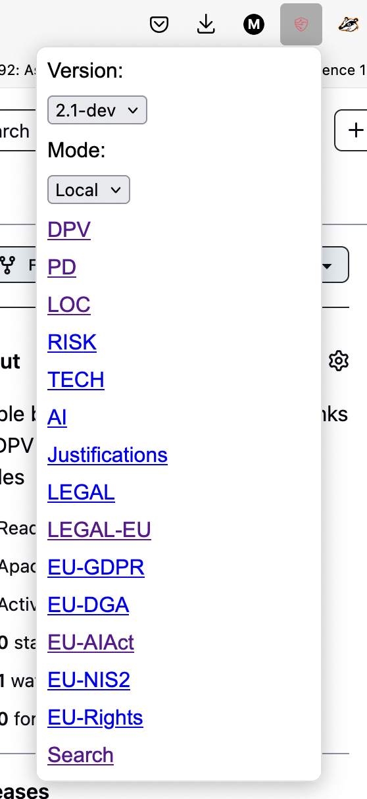

# dpv-browser-extension

Simple browser extension providing links for DPV specs in local, dev, and live modes

Currently tested using Firefox.
Install using https://addons.mozilla.org/en-GB/firefox/addon/dpv-links/ for firefox, 
Or use [latest version from releases](https://github.com/coolharsh55/dpv-browser-extension/releases) and install in the browser.

